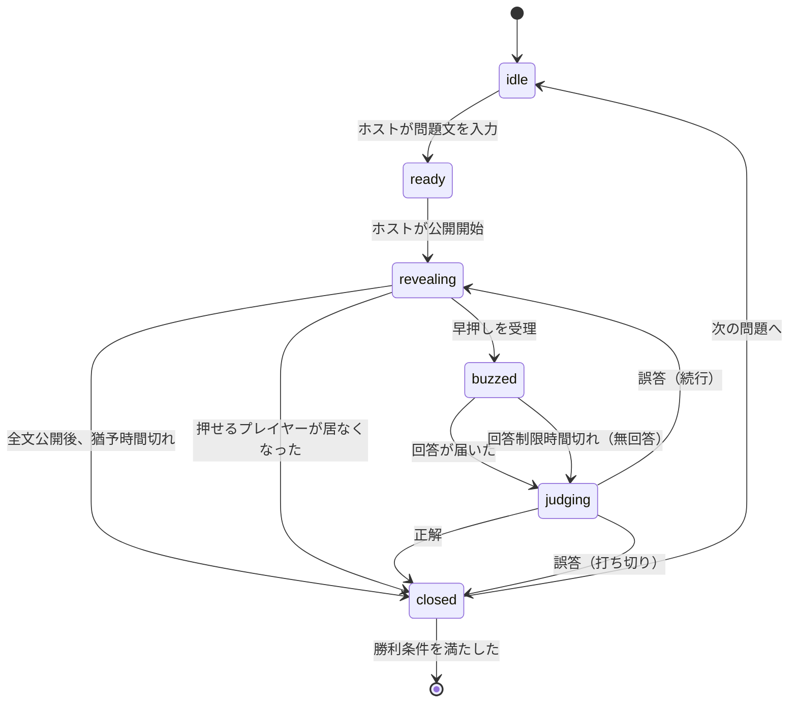

# ゲームルールと状態遷移

オンライン早押しクイズの進行仕様。**M2 のドメイン実装（#8 以降）はこの文書を基準にする。**

## 前提

- **ホストが権威**。判定・順序・状態はすべてホストが決め、プレイヤーはそれに従う
- 通信はホストを中心とした星形の P2P（[通信プロトコル](p2p-protocol.md)）
- **正誤判定はホストの手動**。文字列の自動照合はしない

## 用語

| 用語         | 意味                                                   |
| ------------ | ------------------------------------------------------ |
| ホスト       | ルームを作り、出題と判定を行う人。プレイヤーも兼ねない |
| プレイヤー   | 回答する人                                             |
| 出題         | 1つの問題の開始から終了まで                            |
| ロックアウト | そのプレイヤーが**その問題に限り**押せなくなる状態     |

## 状態遷移

### 各状態

| 状態        | 意味                 | ホストの操作    | プレイヤーの操作         |
| ----------- | -------------------- | --------------- | ------------------------ |
| `idle`      | 問題が未設定         | 問題文を入力    | なし                     |
| `ready`     | 問題文はあるが未公開 | 公開開始        | なし                     |
| `revealing` | 1文字ずつ公開中      | 手動停止        | **早押し**               |
| `buzzed`    | 押した人の回答待ち   | なし（待つ）    | 押した人のみ**回答入力** |
| `judging`   | ホストの判定待ち     | **正解 / 誤答** | なし                     |
| `closed`    | この問題は終了       | 次の問題へ      | なし                     |

### 遷移の詳細

**`revealing` → `buzzed`**
ホストが受信した順で**先着1名**を採用する。ロックアウト済みプレイヤーの押下は無視する。採用と同時に文字送信を止める。

> 順序は**ホストの受信順**で決める。クライアント側のタイムスタンプは改竄できるため信用しない。結果として回線が速いプレイヤーが有利になるが、ホスト権威を保つ以上これは受け入れる。

**`buzzed` → `judging`**
回答が届くか、`answerTimeLimitMs` を過ぎたら遷移する。**時間切れは無回答として扱い、誤答と同じ経路をたどる。**

**`judging` → 次の状態**
ホストの判定と `onWrongAnswer` の設定で決まる。

| 判定 | `onWrongAnswer` | 次の状態     | 付随する処理                           |
| ---- | --------------- | ------------ | -------------------------------------- |
| 正解 | —               | `closed`     | 加点。正解文を全員に開示               |
| 誤答 | `continue`      | `revealing`  | **誤答者をロックアウト**し、公開を再開 |
| 誤答 | `endQuestion`   | `closed`     | 正解文を全員に開示                     |
| 誤答 | `hostDecides`   | ホストが選択 | 上2つのどちらかを選ぶ                  |

**`revealing` → `closed`（誰も正解しない場合）**
2つの経路がある。

1. 全文が公開され、`postRevealGraceMs` を過ぎても誰も押さない
2. **押せるプレイヤーが居なくなった**（全員がロックアウト済み）。`continue` でも続行不能なのでここで終了する

2 は見落としやすい。`onWrongAnswer: continue` のとき、誤答が参加人数分たまると誰も押せなくなる。

## RuleSet

**ルーム作成時にホストが設定する。** 途中変更はしない（進行中に変わると状態機械の前提が崩れるため）。

| 項目                | 型                                                                | 既定値                           | 説明                                               |
| ------------------- | ----------------------------------------------------------------- | -------------------------------- | -------------------------------------------------- |
| `onWrongAnswer`     | `'continue' \| 'endQuestion' \| 'hostDecides'`                    | `'continue'`                     | 誤答時の挙動                                       |
| `answerTimeLimitMs` | `number`                                                          | `10000`                          | 早押し後、回答を送るまでの制限時間                 |
| `revealIntervalMs`  | `number`                                                          | `200`                            | 問題文を1文字送る間隔                              |
| `postRevealGraceMs` | `number`                                                          | `5000`                           | 全文公開後に押下を受け付ける猶予                   |
| `scoring.correct`   | `number`                                                          | `1`                              | 正解時の増減                                       |
| `scoring.wrong`     | `number`                                                          | `0`                              | 誤答時の増減。**負値で減点**（お手つきペナルティ） |
| `winCondition`      | `{ type: 'firstTo'; points: number } \| { type: 'allQuestions' }` | `{ type: 'firstTo', points: 5 }` | 勝利条件                                           |
| `maxPlayers`        | `number`                                                          | `8`                              | 参加上限                                           |

### 拡張するときの注意

RuleSet は**増えることを前提**にしている。追加する項目は次を満たすこと。

- **既定値だけで妥当なゲームが成立する。** 設定必須の項目を増やさない
- **1つの問題の進行中に意味が変わらない。** 進行中に参照される値は出題開始時点のものを使う
- 状態遷移に影響する項目は、この文書の遷移表も同時に更新する

## 得点と勝利条件

得点は `scoring` に従って判定のたびに更新する。**時間切れ（無回答）は誤答として扱う**ので `scoring.wrong` が適用される。

勝利条件は問題が `closed` になった時点で評価する。

| `winCondition` | 判定                                               |
| -------------- | -------------------------------------------------- |
| `firstTo`      | いずれかのプレイヤーが `points` 以上に達したら終了 |
| `allQuestions` | 用意した問題をすべて消化したら、最高得点者が勝ち   |

同点の場合は**引き分け**とする。タイブレークは行わない。

## 決めていないこと

M2 の実装で判断が必要になった時点で、この節に追記するか別途 issue を立てる。

- ホストが切断した場合の扱い（#20 で決める）
- 問題文の事前準備（その場入力のみか、問題リストを持てるか）
- 観戦者（回答しない参加者）
